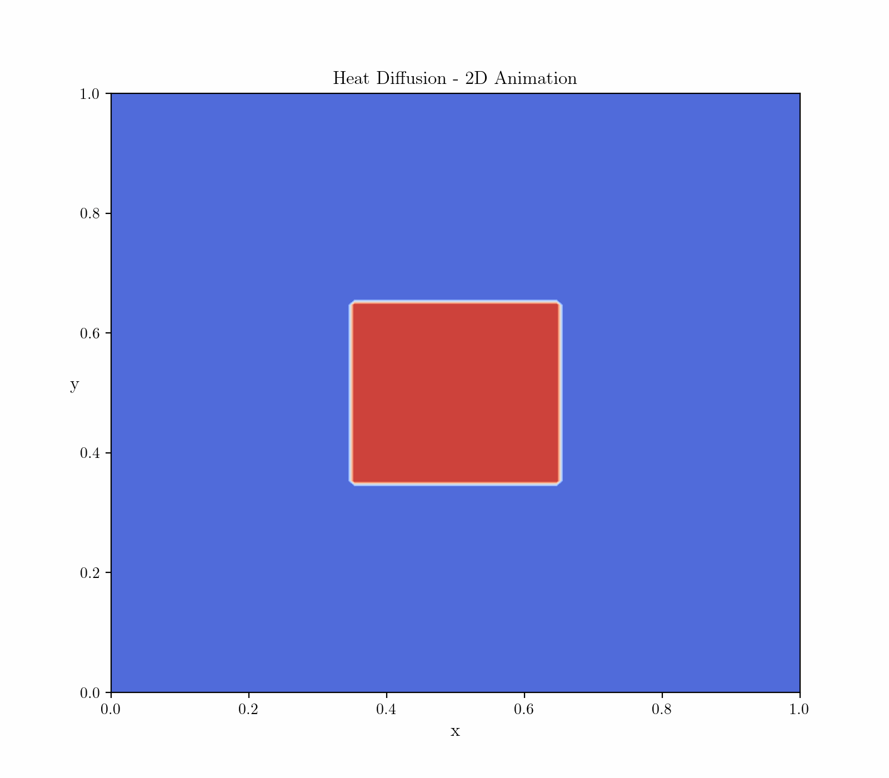
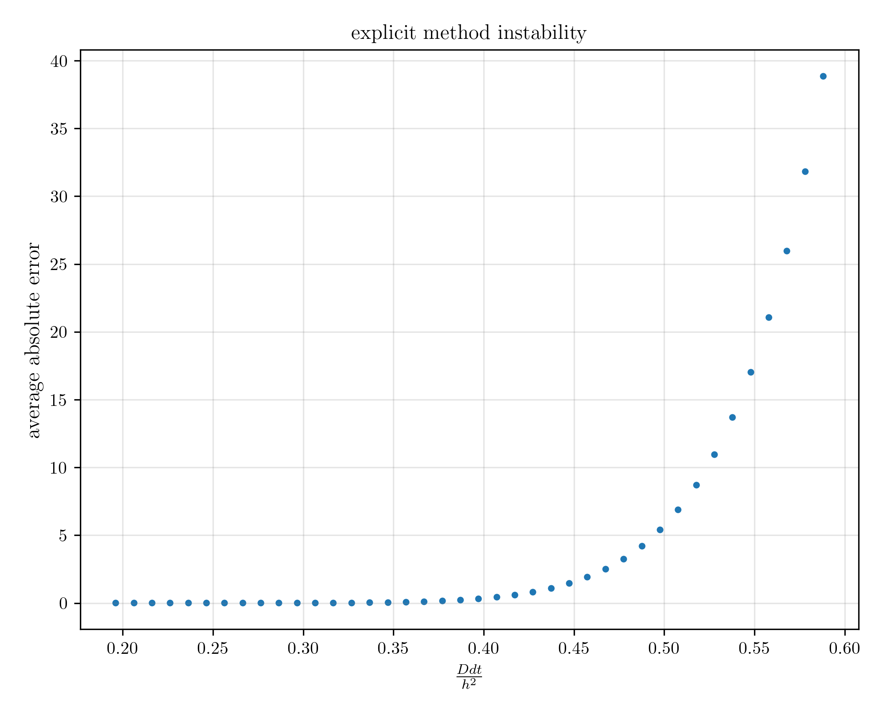

# 2D heat diffusion with explicit and implicit methods
The purpose of this project is to simulate a 2D heat diffusion process in a square simulation cell given Dirichlet boundary conditions. Both explicit and implicit Euler methods are implemented and discussed. More specifically, explicit Euler becomes unstable for large timesteps while implicit Euler is limited to small grids because of limited memory. Suggestions on possible improvements are then proposed. 

## Table of contents
1. [Introduction](#introduction)
2. [Explicit Euler](#explicit)
3. [Implicit Euler](#implicit)

## Introduction 
Simulating a 2D heat diffusion process equates to solve numerically the following partial differential equation:
$$\frac{\partial \rho}{\partial t} = D \bigg(\frac{\partial^2 \rho}{\partial x^2} + \frac{\partial^2 \rho}{\partial y^2}\bigg)$$
where $\rho(x, y, t)$ represents the temperature. The Dirchlet boundary conditions provided are temperature T1 on the four sides of the simulation cell, and temperature T2 in a smaller square concentric to the simulation cell. The initial temperature of the system is T1. 

  

  
   

It is evident from animations that the diffusion process slows down until it converges to a stationary configuration.

## Explicit Euler 
By using the finite differences expansions for all partial derivatives we get:
$$\frac{\rho_{i,j}^{n+1} - \rho_{i,j}^n}{dt} = D \bigg(\frac{\rho_{i+1,j}^n -2\rho_{i,j}^n + \rho_{i-1,j}^n}{h^2} + \frac{\rho_{i,j+1}^n -2\rho_{i,j}^n + \rho_{i,j-1}^n}{h^2}\bigg)$$
where $\rho_{i,j}^n = \rho(x_i, y_j, t_n)$ with the usual discretization. This leads to an explixit propagator:
$$\rho_{i,j}^{n+1} = \rho_{i,j}^n + \frac{D dt}{h^2}(\rho_{i+1,j}^n + \rho_{i-1,j}^n + \rho_{i,j+1}^n + \rho_{i,j-1}^n - 4\rho_{i,j}^n)$$
The main issue with this method is that it becomes unstable as $dt$ gets larger. Using implicit Euler as baseline, we can indeed plot the average absolute error on $\rho$ at $t=t_n$ for different values of $\frac{D dt}{h^2}$:

  

Instability occurs for $\frac{D dt}{h^2} > 0.35$, and it leads to catastrophic effects on the temperatures:

  

## Implicit Euler 
The approach is the same as above but second order partial derivatives are evaluated at $t=t_{n+1}$, thus making the method implicit. We can write:
$$(1+4\frac{D dt}{h^2})\rho_{i,j}^{n+1} - \frac{D dt}{h^2}(\rho_{i+1,j}^{n+1} + \rho_{i-1,j}^{n+1} + \rho_{i,j+1}^{n+1} + \rho_{i,j-1}^{n+1}) = \rho_{i,j}^n$$
or introducing the $N^2 \times N^2$ matrix $M$:
$$M \cdot \rho^{n+1} = \rho^n \implies \rho^{n+1} = M^{-1} \cdot \rho^n$$
This method remains stable as $dt$ gets larger, but the necessity to store in memory the matrix $M$ is a significant bottleneck (for $N=200$ over 12GB of RAM are required assuming double precision). Fortunately the above equation can also be solved iteratively by methods such as *Jacobi* or *Gauss-Seidel*.  
Lastly I compared the two methods for a given point in space over the first 100 iterations:

  

The deviation is small and it vanishes as the system converges to its equilibrium configuration.

